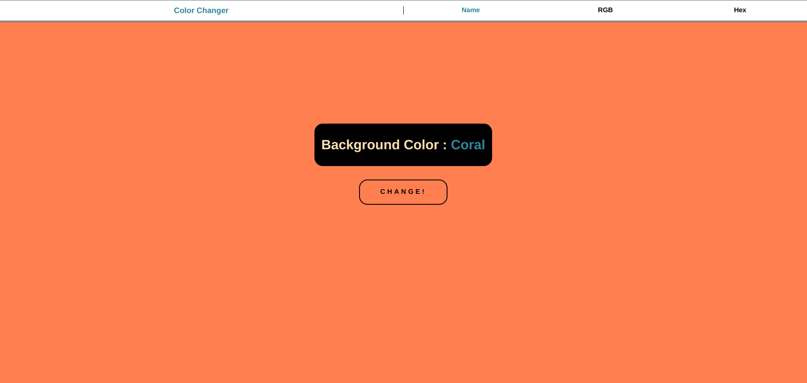

# COLOR PROJECT

## FRONTEND PRACTICE PROJECT NO: 1

1. I used Javascript, Jquery, HTML, CSS to practice my skills.

2. It changes the background color of page by click.

3. From top you can choose one of the options to see the background color by name, rgb or hex.
